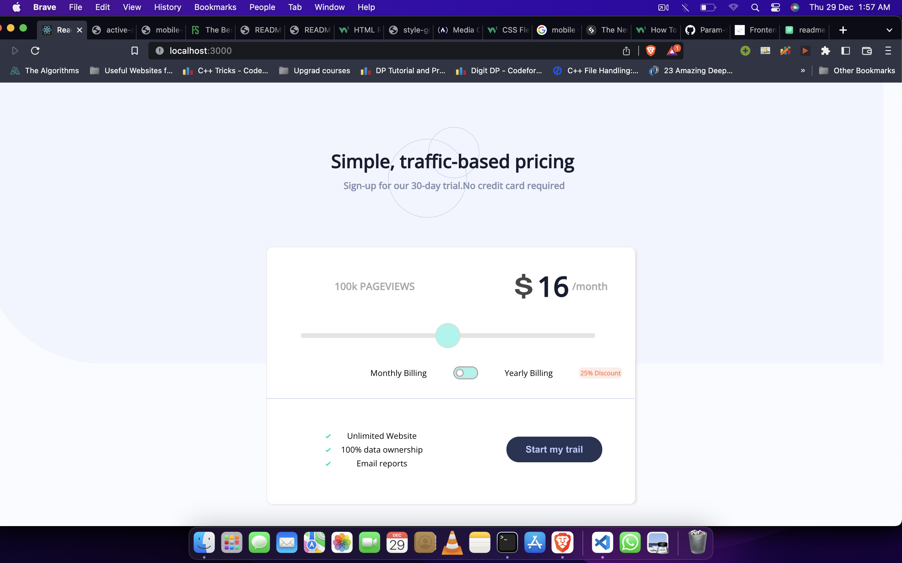
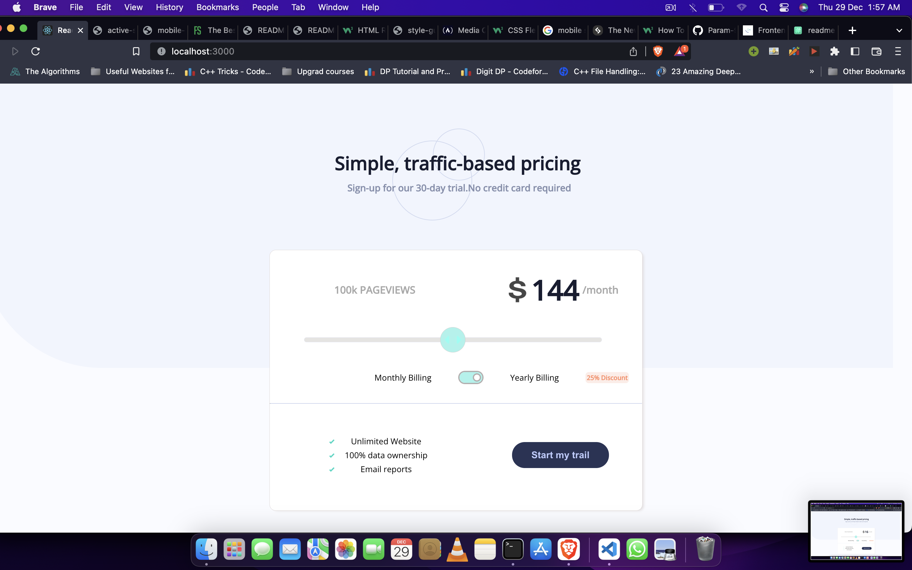
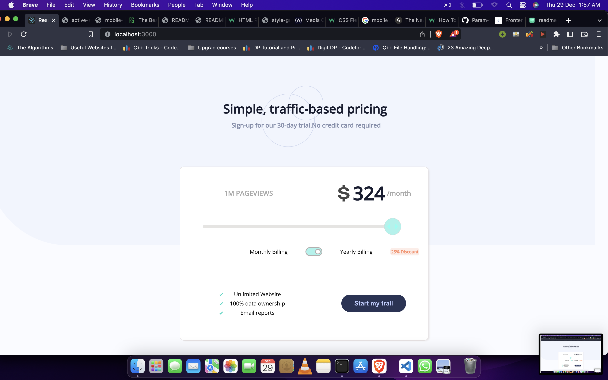

# Frontend Mentor - Interactive pricing component solution

This is a solution to the [Interactive pricing component challenge on Frontend Mentor](https://www.frontendmentor.io/challenges/interactive-pricing-component-t0m8PIyY8). Frontend Mentor challenges help you improve your coding skills by building realistic projects. 

## Table of Content

## Overview

### The challenge

Users should be able to:

- View the optimal layout for the app depending on their device's screen size
- See hover states for all interactive elements on the page
- Use the slider and toggle to see prices for different page view numbers

### Screenshot

## My process

### Built with

- Semantic HTML5 markup
- CSS custom properties using sass 
- Mobile-first workflow
- [React](https://reactjs.org/) - JS library

### What I learned

Its been the first project where i went for making web pages responsive.Readed the articles and implemented it.Strengthen my reactjs concepts through this project.

### Continued development

I will focus on making all my project Responsive.

### Useful resources

- [Range Slider Generator](https://range-input-css.netlify.app/)
- [W3 School Css ](https://www.w3schools.com/css/default.asp)

